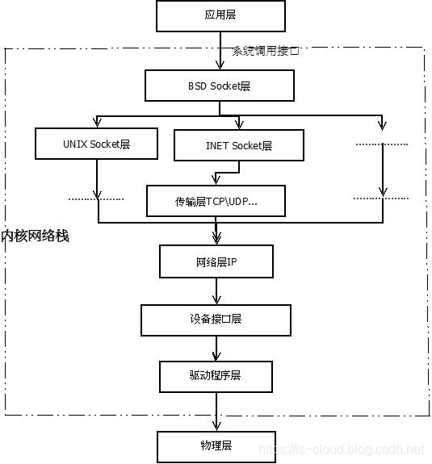

# DPDK 学习笔记

## 简介
DPDK（英语：Data Plane Development Kit），是一组快速处理数据包的开发平台及接口。 运行于Intel X86与arm平台上。

在X86结构中，处理数据包的传统方式是CPU中断方式，即网卡驱动接收到数据包后通过中断通知CPU处理，然后由CPU拷贝数据并交给协议栈。在数据量大时，这种方式会产生大量CPU中断，导致CPU无法运行其他程序。

而DPDK则采用轮询方式实现数据包处理过程：DPDK重载了网卡驱动，该驱动在收到数据包后不中断通知CPU，而是将数据包通过零拷贝技术存入内存，这时应用层程序就可以通过DPDK提供的接口，直接从内存读取数据包。

这种处理方式节省了CPU中断时间、内存拷贝时间，并向应用层提供了简单易行且高效的数据包处理方式，使得网络应用的开发更加方便。但同时，由于需要重载网卡驱动，因此该开发包目前只能用在部分采用Intel网络处理芯片的网卡中。

## Linux 内核网络协议栈

### 数据报文的封装与分用

封装：当应用程序用 TCP 协议传送数据时，数据首先进入内核网络协议栈中，然后逐一通过 TCP/IP 协议族的每层直到被当作一串比特流送入网络。对于每一层而言，对收到的数据都会封装相应的协议首部信息（有时还会增加尾部信息）。TCP 协议传给 IP 协议的数据单元称作 TCP 报文段，或简称 TCP 段（TCP segment）。IP 传给数据链路层的数据单元称作 IP 数据报（IP datagram），最后通过以太网传输的比特流称作帧（Frame）。

分用：当目的主机收到一个以太网数据帧时，数据就开始从内核网络协议栈中由底向上升，同时去掉各层协议加上的报文首部。每层协议都会检查报文首部中的协议标识，以确定接收数据的上层协议。这个过程称作分用。

## Linux 内核网络协议栈

协议栈实现层级：

* 硬件层（Physical device hardware）：又称驱动程序层，提供连接硬件设备的接口。
* 设备无关层（Device agnostic interface）：又称设备接口层，提供与具体设备无关的驱动程序抽象接口。这一层的目的主要是为了统一不同的接口卡的驱动程序与网络协议层的接口，它将各种不同的驱动程序的功能统一抽象为几个特殊的动作，如 open，close，init 等，这一层可以屏蔽底层不同的驱动程序。
* 网络协议层（Network protocols）：对应 IP layer 和 Transport layer。毫无疑问，这是整个内核网络协议栈的核心。这一层主要实现了各种网络协议，最主要的当然是 IP，ICMP，ARP，RARP，TCP，UDP 等。
* 协议无关层（Protocol agnostic interface），又称协议接口层，本质就是 SOCKET 层。这一层的目的是屏蔽网络协议层中诸多类型的网络协议（主要是 TCP 与 UDP 协议，当然也包括 RAW IP， SCTP 等等），以便提供简单而同一的接口给上面的系统调用层调用。简单的说，不管我们应用层使用什么协议，都要通过系统调用接口来建立一个 SOCKET，这个 SOCKET 其实是一个巨大的 sock 结构体，它和下面的网络协议层联系起来，屏蔽了不同的网络协议，通过系统调用接口只把数据部分呈献给应用层。
    * BSD（Berkeley Software Distribution）socket：BSD Socket 层，提供统一的 SOCKET 操作接口，与 socket 结构体关系紧密。
    * INET（指一切支持 IP 协议的网络） socket：INET socket 层，调用 IP 层协议的统一接口，与 sock 结构体关系紧密。
* 系统调用接口层（System call interface），实质是一个面向用户空间（User Space）应用程序的接口调用库，向用户空间应用程序提供使用网络服务的接口。
  
