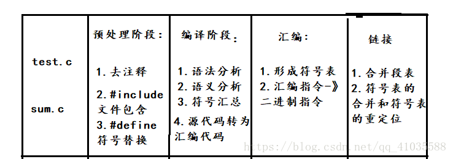
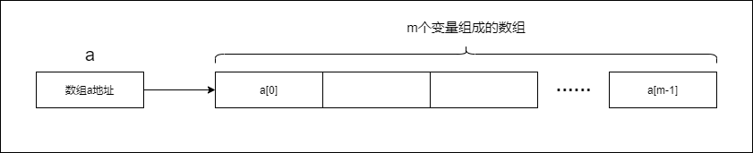
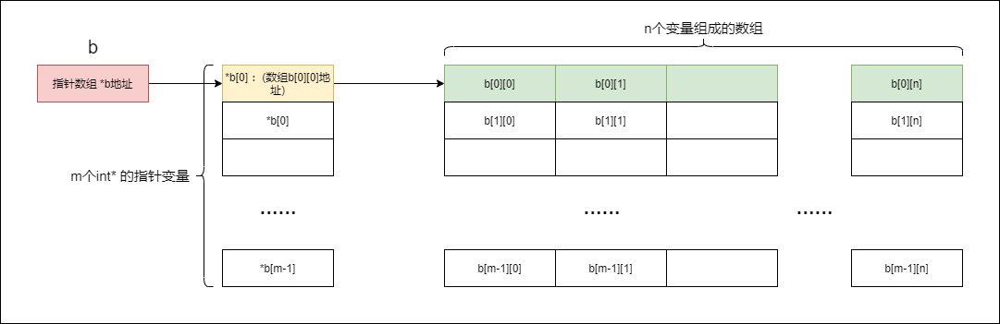

## 编译原理

编译步骤具体如下：

结合linux系统叙述：

    1.预处理 选项 gcc -E test.c -o test.c (-E: Preprocess only; do not compile, assemble or link. -o <file>: Place the output into <file>)

        预处理完成就停下来，产生结果放在test.i文件中。

    2.编译 选项 gcc -S test.c (-S: Compile only; do not assemble or link.)

        编译完成之后就停下来，结果保存在test.s中。

    3.汇编 gcc -C test.c (-c: Compile and assemble, but do not link.)

        汇编完成之后就停下来，结果保存在test.o中。

这篇博客用简单的代码例子讲解了链接的大致过程，还浅谈了有关编写C++头文件的规则：https://www.cnblogs.com/fenglongyu/p/8655104.html
### 静态链接 和 动态链接
在程序链接的阶段，可以采用静态方式或者动态方式。静态链接就是在编译链接时直接将需要的执行代码拷贝到调用处。动态链接就是在编译的时候不直接拷贝可执行代码，而是通过记录一系列符号和参数，在程序运行或加载时将这些信息传递给操作系统，操作系统负责将需要的动态库加载到内存中，然后程序在运行到指定的代码时，去共享执行内存中已经加载的动态库可执行代码，最终达到运行时连接的目的。

静态链接代码装载速度快，执行速度比动态链接快，但生成的可执行文件比较大。

动态链接可以节省内存，减少页面交换。dll文件（拥有外部函数）与exe文件独立，只需要保证接口不变，更换dll文件对exe无影响，极大地提高可维护性和可拓展性。不同的编译语言可以用同一个dll文件。适用于大规模软件开发，使得开发过程独立，耦合度小。缺点是运行速度慢，且dll文件不存在程序会终止运行并报错。

## new/delete 和 malloc/free 的区别与联系
### 区别
1、 malloc/free 是函数（标准库函数 void *malloc(long NumBytes)，void free(void *FirstByte)），new/delete是运算符。

2、 malloc分配内存要进行字节计算和类型转换
 
    
    用malloc 申请一块长度为length 的整数类型的内存，程序如下：
    int *p = (int *) malloc(sizeof(int) * length);
    们应当把注意力集中在两个要素上：
    1)、malloc 返回值的类型是void *，所以在调用malloc 时要显式地进行类型转换，将void * 转换成所需要的指针类型。
    2)、 malloc 函数本身并不识别要申请的内存是什么类型，它只关心内存的总字节数。

使用new更加简便，不需要进行类型转换和字节计算（这是因为new 内置了sizeof、类型转换和类型安全检查功能）：

    int *p1 = (int *)malloc(sizeof(int) * length);
    int *p2 = new int[length];

3、 对于非基本数据类型的对象而言，对象在创建的同时要自动执行构造函数，对象在消亡之前要自动执行析构函数。由于malloc/free是库函数而不是运算符，不能把执行构造函数和析构函数的任务加于malloc/free。因此C++语言需要一个能完成动态内存分配和初始化工作的运算符new，以及一个能完成清理与释放内存工作的运算符delete。
  
4、 new/delete是保留字，不需要头文件支持；malloc/free需要头文件库函数支持。

### 联系
既然new/delete的功能完全覆盖了malloc/free，为什么C++还保留malloc/free呢？因为C++程序经常要调用C函数，而C程序只能用malloc/free管理动态内存。如果用free释放“new创建的动态对象”，那么该对象因无法执行析构函数而可能导致程序出错。如果用delete释放“malloc申请的动态内存”，理论上讲程序不会出错，但是该程序的可读性很差。所以new/delete，malloc/free必须配对使用。

## new/delete用法
一维数组：

    int m;
    cin>>m;
    int *a = new int[m];

    delete[] a;
内存使用情况：
    

二维数组：

    int m,n;
    cin>>m>>n;
    int **b = new int* [m];
    for(int i=0;i<m;i++)b[i] = new int[n];

    for(int i=0;i<m;i++)
        delete[] b[i]; 
    delete[] b;
内存使用情况：
    

## 声明，定义和初始化
变量声明：用于向程序表明变量的类型和名字，但声明不一定引起内存的分配。定义也是声明：当定义变量时我们声明了它的类型和名字。

变量定义：用于为变量分配存储空间，用于存放对应类型的数据，变量名就是对相应的内存单元的命名，还可为变量指定初始值。程序中，变量有且仅有一个定义。

初始化：初始化是给对象赋予初值的过程，初始化由构造函数执行。

    [注意] 
    变量在使用前就要被定义或者声明。 
    定义也是声明，extern声明不是定义
    在一个程序中，变量只能定义一次，却可以声明多次。 
    定义分配存储空间，而声明不会。
    函数的声明和定义区别比较简单，带有{ }的就是定义，否则就是声明。

声明，定义，初始化是变量的三种状态。可以使用  extern告诉编译器变量在其他地方定义了。带有初始化式的声明也是定义，即使前面加了extern。

    extern int i;       //声明，不是定义
    int i;              //声明，也是定义，未初始化
    extern double pi=3.141592654;  //定义，初始化

程序模块化设计风格：

    不要在.h文件中定义变量。
    尽量使用static关键字把变量定义限制于该源文件作用域，除非变量被设计成全局的。
    可以在头文件中声明一个变量，在用的时候包含这个头文件就声明了这个变量。

    模块即是一个.c文件和一个.h文件的结合，头文件(.h)中是对于该模块接口的声明；
 
     某模块提供给其它模块调用的外部函数及数据需在.h中文件中冠以extern关键字声明；
    
    模块内的函数和全局变量需在.c文件开头冠以static关键字声明；
 
## 指针和引用

### 引用当参数和返回值
当函数返回一个引用时，则返回一个指向返回值的隐式指针。这样，函数就可以放在赋值语句的左边，来修改被引用的变量。(使用引用来修改变量值)

    double vals[] = {10.1, 12.6, 33.1};
 
    double& setValues( int i )
    {
    return vals[i];   // 返回第 i 个元素的引用
    }

    int main(){
        cout << vals[0] << endl;
        cout << vals[2] << endl;
        setValues(0) = 11;//通过引用修改vals[]数组
        setValues(2) = 13;
        cout << vals[0] << endl;
        cout << vals[2] << endl;
        return 0;
    }

    main的执行结果为：
    10.1
    33.1
    11
    13

使用引用需要注意作用域，比如当函数返回一个局部变量的引用是不合法的，但返回一个静态变量的引用是合法的。

    int& func() {
    int q;
    //! return q; // 在编译时发生错误
    static int x;
    return x;     // 安全，x 在函数作用域外依然是有效的
    }  

## 宏定义

https://blog.csdn.net/qq_41865229/article/details/86746707

## 语法基础
这里记录一些基础的c++语法
### vector
遍历vector vec

方法1：迭代器输出

    for (vector<int>::const_iterator iter = vec.cbegin();iter != vec.cend(); iter++) {
        cout << (*iter) << endl;
    }

方法2：使用c++新增加的语义auto

      for (auto iter = vec.cbegin(); iter != vec.cend(); iter++) {
    cout << (*iter) << endl;

方法3：使用 .size()方法

    for (int i = 0; i < vec.size(); i++) {
        cout<<vec[i]<<endl;
	}

* 需要注意的是，sizeof(vec)只取决于vector里面存放的数据类型，与元素个数无关。
  
### 类的构造函数
当使用“引用”作为初始化的成员变量时，需要使用“初始化列表”来初始化。

    //假设有一个类 C，具有多个字段 X、Y、Z 等需要进行初始化
    C::C( double a, double b, double c): X(a), Y(b), Z(c)
    {
    ....
    }

### *和&的使用
理解指针 *：当执行 "int* b" 时创建了一个指针类型的变量 b。而对b赋的值需要是地址类型而不能是其他类型，使用“&”可以对变量进行取地址的操作。执行"int a=3; b=&a" 后指针变量b指向了变量a的地址，即b存储的内容是a的地址。"*b" 为变量a的内容，对*b修改会改变a的值。

理解引用 &："int a=3; int &b=a;" 上述语句相当于给变量a起了一个别名b。需要注意的是，a和b实际上都是a，两者地址相同。

函数传入指针参数：函数的形参为指针变量时，会改变调用时传入的值。

    void fun(int *a, int *b)
    {
        int c = 0;
        c = *a;
        *a = *b;
        *b = c;
    }
    int main()
    {
        int a = 1;
        int b = 2;
        cout << a << "," << b << endl;
        fun(&a, &b);//a,b交换
        cout << a << "," << b << endl;
        system("pause");
        return 0;
    }
    最终输出：
    1,2
    2,1
    而如果形参传入普通参数，是不会改变原来的值的。
    原因就在于采用指针参数时，实际的变量就是在a,b,c三者的内存中直接操作的；
    而普通参数则使用了额外的内存，形参操作之后并没有影响原来的内存中的值。

函数传入引用：函数的参数为 引用 时，会改变原本的值。

    void fun(int &a, int &b)
    {
        int c = 0;
        c = a;
        a = b;
        b = c;
    }
    int main()
    {
        int a = 1;
        int b = 2;
        cout << a << "," << b << endl;
        fun(a, b);//a,b交换
        cout << a << "," << b << endl;
        system("pause");
        return 0;
    }
    最终输出：
    1,2
    2,1
    原因是main函数中向fun函数传入了a和b的引用，而引用和原变量的地址是相同的，
    相当于还是在原变量的地址上操作，所以实现了swap。

### #ifdef和#ifndef的使用
一般情况下，源程序中所有的行都参加编译。但是有时希望对其中一部分内容只在满足一定条件才进行编译，也就是对一部分内容指定编译的条件，这就是“条件编译”。有时，希望当满足某条件时对一组语句进行编译，而当条件不满足时则编译另一组语句。 条件编译常见的形式为：

    #ifdef 标识符 
    程序段1 
    #else 
    程序段2 
    #endif
    它的作用是：当标识符已经被定义过(一般是用#define命令定义)，则对程序段1进行编译，否则编译程序段2。 

在头文件中使用条件编译很有必要，可以防止出现重复定义。

### 回调函数
https://www.cnblogs.com/smartlife/articles/12519130.html

程序通过参数把回调函数的函数指针传递给了其它函数，在那个函数里面调用这个函数指针就相当于调用这个函数，这样的过程就叫回调。

应用在具体的问题中，可以理解为库开发者和用户之间约定的一种函数调用规则。用户编程时需要使用库开发者定义的某个函数b()，但是函数b()无法自己实现全部功能，它需要反过头来调用用户的某个函数a()。为了达成一定的规则，库开发者会约定接口规范，即回调函数a()的函数原型，原型最好遵循下面的形式：

    typedef void (*SCT_XXX)(LPVOID lp, const CBParamStruct& cbNode);
SCT_XXX是回调函数名称，lp是回调上下文，CBParamStruct是回调参数。
库开发者提供了回调函数的原型，并且需要给出注册回调函数，实际使用中注册回调函数就是给用户调用的函数，它的参数会有回调函数原型的函数指针。注册回调函数的形式遵循：
    
    void RCF_XXX(SCT_XXX pfn, LPVOID lp); 
RCF_XXX是注册函数名，pfn是回调函数名称（函数指针）。

场景也可能为应用程序中多模块之间的协同工作，假如现在一个系统中有两个模块，通讯模块和数据处理模块需要进行协作，通讯模块负责接收数据并交给数据处理模块，而数据处理模块负责对收到的数据进行处理，那么通讯模块如何实时将。

通讯模块：

    //定义回调函数原型
    typedef void (*DataReceiveCBFunc)(ReceiveParam & recvParam);

    //注册回调函数，给数据接收模块调用，开始接收
    static BOOL StartReceive(DataReceiveCBFunc pfnData, LPVOID lpContext,……);

    //接收数据的现场，一收到数据就通知回调
    static UINT TH_Receive(LPVOID lp);

数据处理模块：

    //开始接收数据的函数，开启监听线程，调用上面的StartReceive函数
    int StartReceiveInfo(int nListenPort, std::string strLocalIP);

    //数据接收回调函数，根据原型编写，被TH_Receive通知回调之后执行内部的代码
    static void RecvInfoCallback(ReceiveParam &recvParam);  

### 结构体使用构造函数

    //Definition for singly-linked list.
    struct ListNode {
        int val;
        ListNode *next;
        ListNode() : val(0), next(nullptr) {} //使用初始化列表的方式来设置值
        ListNode(int x) : val(x), next(nullptr) {}
        ListNode(int x, ListNode *next) : val(x), next(next) {}
    };

    //初始化
    ListNode ln1 = ListNode();//方式1
    ListNode ln2 = ListNode(0);//方式2
    ListNode ln3 = ListNode(0,&ln2);//方式3

### C++标准模板库 STL
http://c.biancheng.net/cplus/80/

C++ 的一个特点在于通过模板的概念实现了对泛型程序设计的支持。C++标准模板库STL是泛型编程的成功例子。

## const的理解
1、一个经典的问题，const修饰指针变量，问以下两种声明的区别：
1)  const char * p
2)  char * const p

这里的 const 关键字是用于修饰常量，书上说 const 将修饰离它最近的对象，所以，以上两种声明的意思分别应该是：
1)  p 是一个指向常量字符的指针，不变的是 char 的值，即该字符的值在定义时初始化后就不能再改变。
2)  p 是一个指向字符的常量指针，不变的是 p 的值，即该指针不能再指向别的。

Bjarne 在他的《The C++ Programming Language》里面给出过一个助记的方法——“以 * 分界，把一个声明从右向左读”。*读作

2、const成员变量
const 成员变量的用法和普通 const 变量的用法相似，只需要在声明时加上 const 关键字。初始化 const 成员变量只有一种方法，就是通过构造函数的初始化列表。

3、const在函数不同位置的用法：

1)函数开头的 const 用来修饰函数的返回值：

    1句话：修饰的是返回值，表示返回的指针所指向的量是常量。

    详见下面代码：
    class TestClass {//声明
    public:
        const char* getPContent();
    private:
        char *pContent;
    };
    const char* TestClass::getPContent(){//函数名前加const
        return pContent;
    } 

    int main(){
        TestClass *tc =new TestClass;
        char * content = tc->getPContent();      //A
        return 0;
    }  

    A处标记的语句在编译时会出错，原因在于被const在函数名开头修饰的函数返回值不能被更改，而语句A的指针变量content是可以被修改的，所以语句A应该改为： 
    const char * content = tc->getPContent(); 

2）函数头部的结尾加上 const 关键字

    1句话：该函数为只读函数，不允许修改其中的数据成员的值。

    const 成员函数可以使用类中的所有成员变量，但是不能修改它们的值，这种措施主要还是为了保护数据而设置的。const 成员函数也称为常成员函数。
    我们通常将 get 函数设置为常成员函数。读取成员变量的函数的名字通常以get开头，后跟成员变量的名字，所以通常将它们称为 get 函数。看下面例子：

    class Student{
    public:
        Student(char *name, int age, float score);
        //声明常成员函数
        char *getname() const;
        int getage() const;
        float getscore() const;
    private:
        char *m_name;
        int m_age;
        float m_score;
    };

## 数组作为成员变量
1、固定数组长度，需要在类定义中明确其长度，并在对象初始化时挨个赋值；

2、也可以使用动态数组传指针的方式：类中定义一个指针的成员变量，对象初始化时后动态数组赋值给指针成员变量。通过这种方式就可以正常访问该数组了，但是由于传入了指针，所以不知道数组长度，需要同时有一个成员变量来说明数组的长度（如果成员变量是私有的，可能还需要使用构造函数来初始化值）。例子见下面代码：

    class A{
    public:
        int *nums;
        int length;
        void handleNums(){······};
    }
    int main(){
        int *b = new int[7];//定义一个动态数组
        ······              //为动态数组赋值
        A a;
        a.nums = b;
        a.length = 7;
        a.handleNums();
    }

    //私有的成员变量，使用构造函数
    class A{
    public:
    	A(int *i, int j) { nums = i; length = j; }//构造函数
	    //A(int *i, int j):nums(i), length(j) {}; //使用初始化列表构造方法
        void handleNums(){······};
    private:
        int *nums;
        int length;
    }
    int main(){
        int *b = new int[7];//定义一个动态数组
        ······              //为动态数组赋值
        A a(b,7);
        a.handleNums();
    }

## 数据结构——树
详细的教程可以看：https://www.zhihu.com/question/30527705/answer/1663740519

## 疑问：
