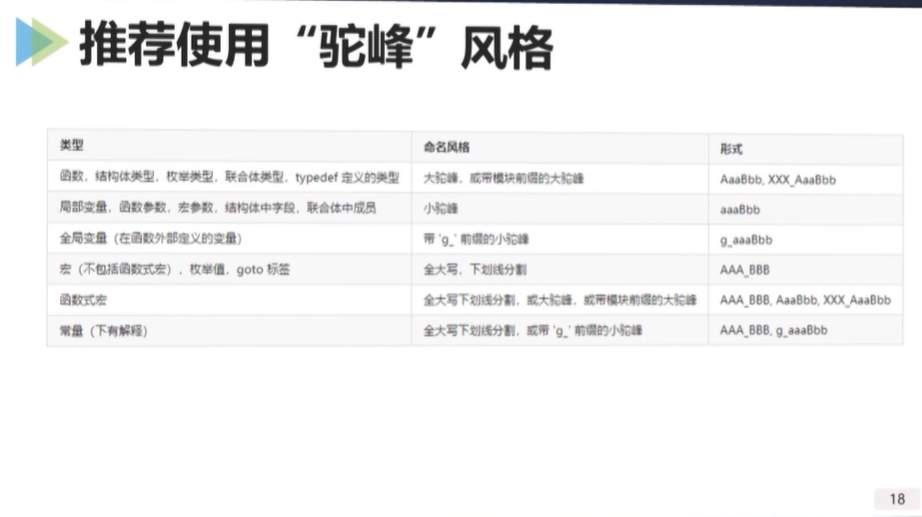

# 华为C语言编程规范
## 注意动词的用法
1. get
2. update
3. fill
4. read

## 标识符命名
### 作用域
作用域越大，命名越精确。

作用域小，如机构体内，不要冗余重复（DRY,DONT REPEAT YOUSELF）

### 不要使用“匈牙利”风格
name 字段里面包含了其他比如type，size等信息。

### 推荐使用“驼峰”风格

## 注释
### 按需注释
按需注释，全面且不冗余。

## 格式

### 行宽与可读性
行宽不超过120个字符

### 换行
选择合适断点换行，不破坏局部整改性

# C语言编程实践
## 预处理
C预处理器（C Preprocessor，CPP）是一个文本替换工具，有多种指令，如下所述。

    1. #define MAX_HEIGHT 10 这个指令告诉 CPP 把所有的 MAX_Height 替换为 10 
    2. #include <stdio.h> 指令告诉 CPP 从系统库中获取 stdio.h，并添加文本到当前的源文件中
    3. #include "myheader.h" 告诉 CPP 从本地目录中获取 myheader.h，并添加到当前的源文件
    4. #undef  FILE_SIZE 指令告诉 CPP 取消已定义的 FILE_SIZE
    5. #ifndef MESSAGE
           #define MESSAGE "You wish!"
       #endif
       指令告诉 CPP 只有当 MESSAGE 未定义时，才定义 MESSAGE
    
预定义的宏，ANSI C定义了可直接使用的宏，包括\_\_DATE\_\_，\_\_TIME\_\_，\_\_FILE\_\_	，\_\_LINE\_\_，\_\_STDC\_\_。

* 注意事项：单条语句不加分号；宏参数缺少完备的括号；多条语句未用do-while(0)；宏定义不要依赖宏外部的局部变量；慎用goto等改变程序流程的语句。

## 函数

### 出参 和 返回值

2.d
3.d
5.abc
9.ab
21.bcd