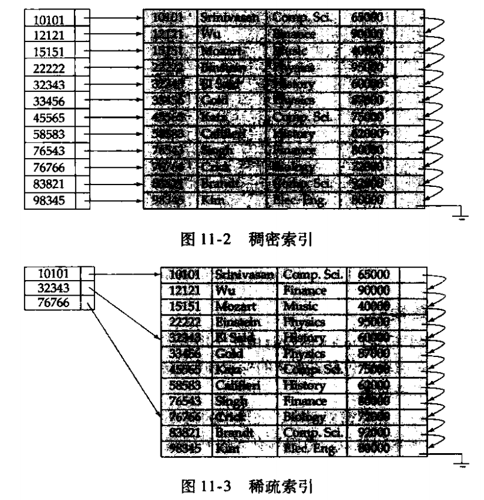
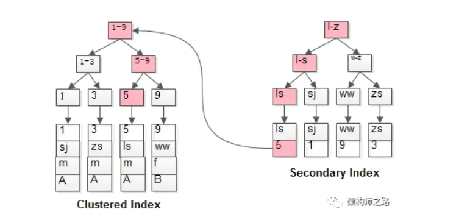
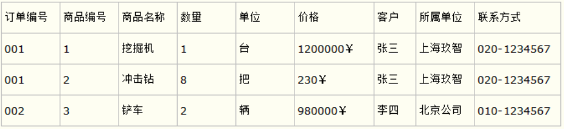
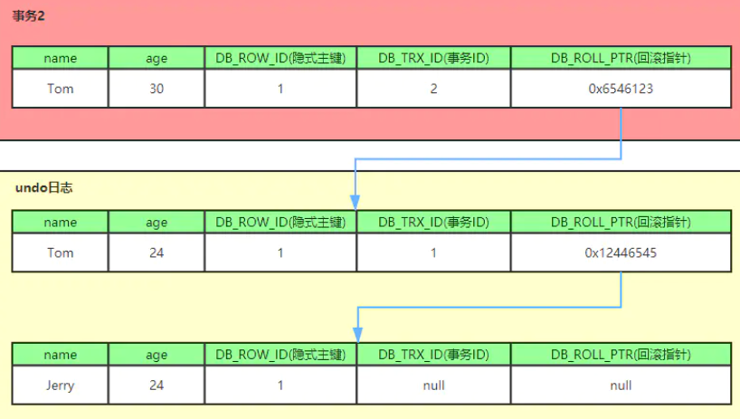

# 数据库学习总结
面试问题汇总： https://leetcode-cn.com/circle/discuss/6xECGC/
## 关系数据库

### 键
* 超键，一个或多个属性的组合，通过超键可以在一个关系中唯一的标识一个元组。
* 候选键，最小超键，其任意真子集都不能成为超键
* 主键，是一个候选键

### 外键
现有一个班级表和学生表，班级表指示了班级的id、班号等信息，学生表是所有学生相关信息的表。
班级表如下图：
| id     | name     | other column |
| :------: | :------: | :------:|
| 0        | 一班     | ···         |
| 1        | 二班     | ···         |
| ···        | ···     |···        |

学生表如下图：
| id     | name     | other column |
| :------: | :------: | :------:|
| 0        | 小明     | ···         |
| 1        | 小王     | ···         |
| ···        | ···     |···        |

现在的问题在于如何确定某个学生是几班的？这种关系是一对多的，即一个班级的记录可以对应多条学生记录。为了表达这种一对多的关系，我们需要在学生表中加入一列 class_id ，让它的值与班级表的某条记录相对应：
| id     |class_id| name     | other column |
| :------: | :------: | :------:| :------:|
| 0        |1| 小明     | ···         |
| 1        |1| 小王     | ···         |
| 1        |2| 小白     | ···         |
| ···        | ···     |···        |

这样，我们就可以根据class_id这个列直接定位出一个students表的记录应该对应到班级表的哪条记录。  

在students表中，通过class_id的字段，可以把数据与另一张表关联起来，这种列称为外键。  

外键并不是通过列名实现的，而是通过定义外键约束实现的：  

    ALTER TABLE students
    ADD CONSTRAINT fk_class_id
    FOREIGN KEY (class_id)
    REFERENCES classes (id);

其中，外键约束的名称fk_class_id可以任意，FOREIGN KEY (class_id)指定了class_id作为外键，REFERENCES classes (id)指定了这个外键将关联到classes表的id列（即classes表的主键）。
## SQL （Structured Query Language，结构化查询语言）

## 索引
### 索引类型：  
* 顺序索引：基于值的顺序排序
* 散列索引：基于散列函数将值分到若干桶里  

索引结构与一个特定的搜索键相关联。  
具体的一个索引项由一个搜索键值和指向该索引值的一条或多条记录的指针组成。

### 搜索键（search key）
用于在文件中查找记录的属性和属性集称为搜索键。

### 顺序索引（索引项中的搜索键是顺序的）
顺序索引按照顺序存放搜索码的值，即索引项中的搜索键码值是按照顺序存放的。但是在对应的数据库文件中，记录可能按照与搜索键值同样的顺序存放（主索引），也可能具有不同的顺序（辅助索引）。

* 聚集索引（主索引）：包含记录的文件按照搜索键排序（主索引的搜索键通常为主键，但是实际上它可以建立在任意搜索键上）  
  
    聚集索引由于搜索键按照顺序存放于存储空间，因此我们可以实现顺序访问和随机访问（随机访问通过首地址+偏移量 实现）

  * 稠密索引：每个搜索键值都有一个索引项。索引项包括搜索键值以及指向具有该搜索键值的第一条数据记录的指针。
  
  * 稀疏索引：只为搜索键的某些值设置索引项。查找一条记录时，从小于等于该记录的搜索键值的索引项开始顺序查找。
  
    

* 非聚集索引（辅助索引）：搜索键的顺序和文件的数据顺序不同。  
    辅助索引必须是稠密索引。原因是如果采用稀疏索引，两个有索引项的搜索码值之间的记录可能存在于文件任何位置。

    　在聚簇索引之上创建的索引称之为辅助索引，辅助索引访问数据总是需要二次查找。辅助索引叶子节点存储的不再是行的物理位置，而是主键值（候选键）。通过辅助索引首先找到的是主键值，再通过主键值找到数据行的数据页，再通过数据页中的Page Directory找到数据行。

    而对于稠密索引而言，我们也分两种情况，索引键是候选键或不是候选键。对于搜索键是候选键的情况而言，直接采用稠密索引的方式即可解决；对于搜索键是非候选键而言，需要使用一个附加的间接指针层，中间层采用一个候选键。

### 散列索引
基于HASH技术，可以避免我们去访问过多的索引。  
* 静态散列   
  hash函数固定，但随着数据增大，同一个hash对应下的数据量可能巨大

* 动态散列
通过桶的分裂或者合并，来适应数据库大小的变化。

## B+树索引
本质上是多级索引。

叶子节点上存放数据库文件信息，非叶子节点上存放索引。

B+树 对比 B树：  

* b+树的中间节点不保存数据，所以磁盘页能容纳更多节点元素，更“矮胖”；
* b+树查询必须查找到叶子节点，b树只要匹配到即可不用管元素位置，因此b+树查找更稳定（并不慢）；
* 对于范围查找来说，b+树只需遍历叶子节点链表即可，b树却需要重复地中序遍历。

除数据库外，还有文件系统的索引也用到了B+树。

## 前缀索引 和 覆盖索引
数据库变大之后，索引也会变长，前缀索引即只使用正常索引的一部分作为索引项。  
覆盖索引即索引项包含了数据库的数据。

## 回表查询
InnoDB聚集索引的叶子节点存储行记录，辅助索引存储叶子节点存储主键（或者候选键）值。  
所以在使用辅助索引查询时，只查到了主键值，需要再使用聚集索引再查找一次，这就是回表查询。如下图所示。  

## 三大范式

1、所有字段值都是不可分解的原子值  
比如某些数据库系统中需要用到“地址”这个属性，本来直接将“地址”属性设计成一个数据库表的字段就行。但是如果系统经常会访问“地址”属性中的“城市”部分，那么就非要将“地址”这个属性重新拆分为省份、城市、详细地址等多个部分进行存储，这样在对地址中某一部分操作的时候将非常方便。这样设计才算满足了数据库的第一范式。  
2、一个数据库表中，一个表中只能保存一种数据，不可以把多种数据保存在同一张数据库表中。  
比如要设计一个订单信息表，因为订单中可能会有多种商品，所以要将订单编号和商品编号作为数据库表的联合主键。这样就产生一个问题：这个表中是以订单编号和商品编号作为联合主键。这样在该表中商品名称、单位、商品价格等信息不与该表的主键相关，而仅仅是与商品编号相关。所以在这里违反了第二范式的设计原则。  
  
3、每一列数据都和主键直接相关，而不能间接相关。

## 隔离级别

1、READ UNCOMMITTED （未提交读）

　　在 READ UNCOMMITTED 级别，事务中的修改，即使没有提交，对其他事务也都是可见的。事务可以读取未提交的数据，这也被称为脏读（Dirty Read)。这个级别会导致很多问题，从性能上来说，READ UNCOMMITTED 不会比其他的级别好太多，但却缺乏其他级别的很多好处，除非真的有非常必要的理由，在实际应用中一般很少使用。

2、READ COMMITTED （提交读）

　　大多数数据库系统的默认级别都是 READ COMMITTED（但 MySQL 不是）。READ COMMITTED 满足前面提到的隔离性的简单定义：一个事务开始时，只能“看到”已经提交的事物所做的修改。换句话说，一个事务从开始直到提交之前，所作的任何修改对其他事务都是不可见的。这个级别有时候也叫做不可重复读（nonrepeatable read），因为两次执行相同的查询，可能会得到不一样的结果。

发生幻读：其他事务在某事物开始之前和提交之后进行读取，所获取到的数据不一致。

3、REPEATABLE READ (可重复读）

　　REPETABLE READ 解决了脏读的问题。该级别保证了在同一个事务中多次读取同样记录的结果是一致的。但是理论上，可重复读隔离级别还是无法解决另外一个幻读（Phantom Read) 的问题。所谓幻读，指的是当某个事务在读取某个范围内的记录时，另外一个事务又在该范围内插入了新的记录，当之前的事务再次读取该范围的记录时，会产生幻行（Phantom Row）。InnoDB 和 XtraDB 存储引擎通过多版本并发控制（MVCC，Multiversion Concurrency Control) 解决了幻读的问题。可重复读是MySQL的默认事务隔离级别。

4、SERIALIZABLE （可串行化）

　　SERIALIZABLE 是最高的隔离界别。它通过强制事务串行执行，避免了前面所说的幻读的问题。简单来说，SERIALIZABLE会再读取的每一行数据上都加锁，所有可能导致大量的超时和锁争用的问题。实际应用中也很少用到这个隔离级别，只有在非常需要保证数据的一致性而且接受没有并发的情况下，才考虑采用该级别。

## 数据库事务并发控制
* 基于锁的协议，即两阶段封锁协议 2PL，第一阶段只允许增加锁，第二阶段只允许释放锁。

  多粒度封锁协议，根据意向共享(IS)，意向排他(IX),共享及意向排他(SIX),和共享锁（S）和排他锁（X）来确定是否可以给某个数据加锁。

      事务Ti 根据下列规则来封锁一个节点Q:  

      1、必须遵守锁相容性矩阵.
      2、必须首先对树根加锁, 并且可以任何方式加锁.
      3、仅当节点Q 的父节点当前被Ti 以IX或IS方式封锁时, Q 才可被Ti 以S或IS方式加锁.
      4、仅当节点Q 的父节点当前被Ti 以IX或SIX方式封锁时, Q 才可以被Ti 以X, SIX, 或IX方式加锁.
      5、仅当Ti 先前没有对任何节点开锁时才可以对一个节点加锁(即, Ti 是两阶段的).
      6、仅当Q 的子女当前没有被Ti 封锁时, Ti 才可以对节点Q 开锁.
 

* 基于树的协议，只能给子节点无锁或者父节点已被本事务加锁的节点加锁。

* 基于时间戳的协议，预先为每个事务定序(可串行化序)。
  
        为实现这种方案, 为每个数据Q 维护两个时间戳值:
        W-timestamp(Q)是成功执行了write(Q)的所有事务中的最大时间戳.
        R-timestamp(Q)是成功执行了read(Q)的所有事务中的最大时间戳.

  每个事务Ti 具有时间戳TS(Ti)，按如下方法确定顺序。
    * 假设事务Ti 发出read(Q)  
        1、若TS(Ti) < W-timestamp(Q), 则Ti 需要读的Q的值已经被写覆盖.因此, read 操作被拒绝, Ti  回滚.  
        2、若TS(Ti) >= W-timestamp(Q), 则执行read操作, 并将R-timestamp(Q) 置为max(R-timestamp(Q), TS(Ti )).    
    * 假设事务Ti 发出write(Q)
        1、若TS(Ti) < R-timestamp(Q), 则Ti 要产生的Q 值是过去需要的, 而系统假设该值永远不会产生了. 于是, write 操作被拒绝, Ti 回滚.  
        2、若TS(Ti) < W-timestamp(Q), 则Ti 试图写一个过时的Q 值. 
        因此, 这个write 操作被拒绝, Ti 回滚.  
        3、否则, 执行write操作, 且将W-timestamp(Q) 置为TS(Ti).
 
* MVCC 
  
  解决读写并发问题，即解决幻读（幻行）问题。

  利用隐式字段、Read-View（快照读）和undo日志来实现。

  * 隐式字段（每条数据项所附加）：

    DB_ROW_ID：隐式的自增ID  
    DB_TRX_ID：最近修改这条数据的事务ID.   
    DB_ROLL_PTR：回滚指针，指向上一条数据项。

  * undo日志如下 
    

  * Read-View
    是事务进行快照读操作时产生的读视图，具体保存了当前活跃事务的事务ID。

  * 实施过程：  
    * 事务执行快照读时，会生成数据库系统当前的一个快照，记录当前系统中还有哪些活跃的读写事务，把它们放到一个列表里。
    * 假设当前快照读需要读取的数据项中具有隐式字段DB_TRX_ID（最后一个修改该数据的事务ID）。同时用min_limit_id:m_ids代表快照事务列表中，最小的事务ID， max_limit_id:m_ids代表快照事务列表中最大的事务ID。
    * 如果DB_TRX_ID < min_limit_id，表明修改该数据目前版本的事务在生成ReadView前已经提交(因为事务ID是递增的)，所以该版本的数据可以被当前事务访问。
    * 如果DB_TRX_ID > m_ids列表中最大的事务id，表明生成该版本数据的事务在生成ReadView后才生成，所以该版本不可以被当前事务访问。
    * 如果 min_limit_id =\<DB_TRX_ID\<= max_limit_id,需要判断m_ids.contains(DB_TRX_ID)，如果在，则代表Read View生成时刻，这个事务还在活跃，还没有Commit，修改的数据，当前事务是看不见的；如果不在，则说明，你这个事务在Read View生成之前就已经Commit了，修改的结果，当前事务是能看见的。

## 数据库日志
在事务系统的运行当中，有三个地址空间供元素存储：1)磁盘空间、2)缓冲区、3)事务的局部地址空间。  
一个简单的读、修改X元素操作的流程如：事务到缓冲中读取元素X，如果命中，则读取事务局部地址空间并返回，如果未命中，则先将相关页从磁盘读入缓冲区。事务在它的局部地址空间中修改元素X，然后写入缓冲区，再从缓冲区写入磁盘。当然缓冲区的数据也可能不是立即拷贝入磁盘的，这取决于具体的缓冲区管理策略。  
为了便于描述，我们描述了五个操作原语：

      1） INPUT（X）：将包含数据库元素X的磁盘块拷贝到内存缓冲区
      2） READ（X,t）：将数据库元素X拷贝到事务的局部变量t。更准确地说，如果包含数据库元素X的块不在内存缓冲区中，则首先执行INPUT（X）。接着将X的值赋给局部变量t。
      3） WRITE（X,t）：将局部变量t的值拷贝到内存缓冲区中的数据库元素X。更准确地说，如果包含数据库元素X的块不在内存缓冲区中，则首先执行INPUT（X）。将着将t的值拷贝到缓冲区中的X。
      4） OUTPUT（X）：将包含X的缓冲区拷贝到回磁盘。

### undo 日志
日志写规则：

    规则1）如果事务T改变了数据库元素X，那么形如<T, X, v>的日志记录必须在X的新值写到磁盘前写到磁盘。
    规则 2）如果事务提交，则其COMMIT日志记录必须在事务改变的所有数据库元素已写到磁盘后再写到磁盘，但应尽快。
    （总结： 日志写优先级高于数据，commit日志写优先级低于数据）

日志恢复：  
从日志尾向前扫描，要想利用undo日志使我们从系统故障中恢复，需要：

    1） 如果T的COMMIT记录已被扫描到，则什么也不做。
    2） 否则，将数据库中元素X的值改为v。在做完这些操作后，为以前未中止且未完成的每个事务T写入一个日志记录\<ABORT T>，然后刷新日志。
### redo日志
 Redo日志系统的规则只有一条：  

    规则1：在修改磁盘上任何数据库元素X之前，要保证所有与X这一修改相关的日志记录，包括更新记录<T，X，v>以及<COMMIT T>记录，都必须出现在磁盘上。
    （总结：日志优先级高于数据，且必须写完一个事务的所有日志才能写数据）

对于redo日志，根据规则1，我们可以知道如果日志没有\<COMMIT T记录>，则事务T的修改所做的所有的更新都没反映到磁盘上，就像事务T从来没有发生过一样。    
 如果发现记录\<COMMIT T>记录，却不敢保证所有的数据库修改已经反映到磁盘上，这和undo日志是相反的。我们必须将事务T重做一次。  
 使用redo日志恢复，过程如下：  

    1） 确定提交事务
    2） 从首部开始扫描日志，对遇到的每一<T，X，v>记录：
        （a）：如果T是未提交的事务，则什么也不做。
          (b)：如果T是提交的任务，则为磁盘上数据库元素写入值v
    3）对于每一个未完成的事务T，在日志中写入一个<ABORT T>记录并刷新日志。

### redo 和 undo的区别
redo log 针对于事务的持久性；undo针对事务的原子性。

### 检查点
静态检查点： 暂停新事务，并等待所有旧事务完成，插入检查点。

非静态检查克服了该缺点，在做检查点时允许新事务进入。步骤如下：

    1） 写入日志记录<START CKPT(T1,……,Tk)>.其中T1,……,Tk为活跃事务。
    2） 等待T1,……,Tk每一个事务提交或终止，但允许其它事务开始。
    3） 当T1,……,Tk都已完成时，写入日志记录<END CKPT>并刷新日志。

## 死锁处理
并发控制的方法可能导致死锁。可采用死锁预防和死锁检测与恢复的方法。

