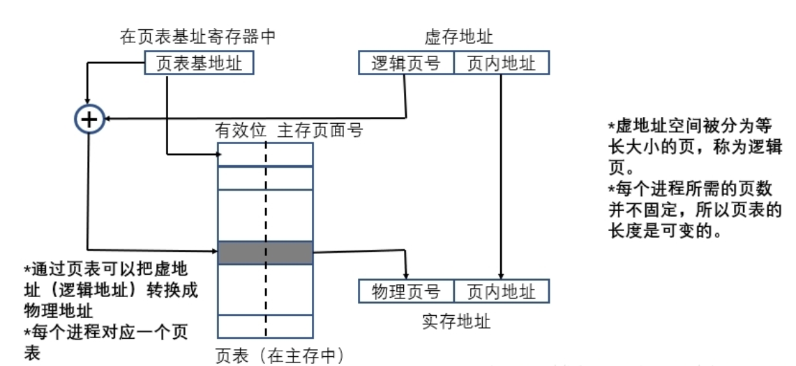
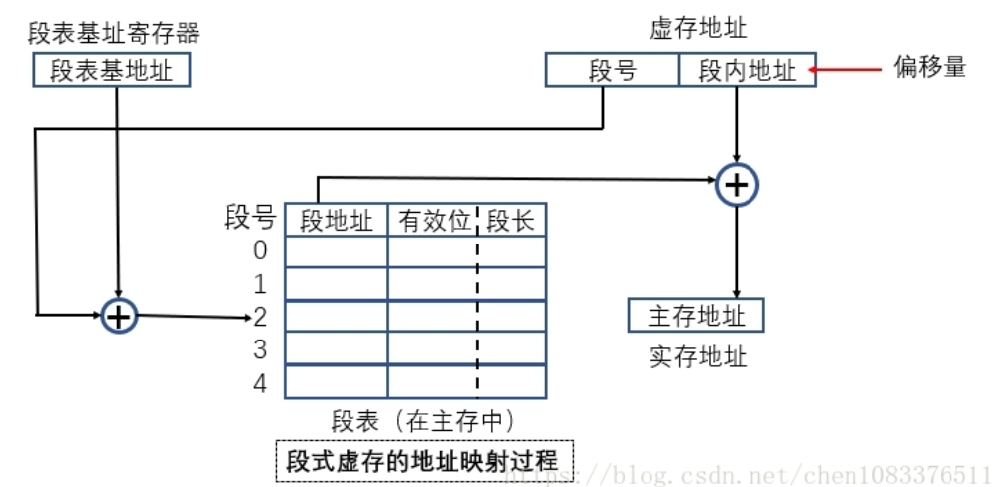

# 计算机组成原理
## 虚存
### 页式虚拟存储器
地址映射过程如下：    

* 首先，页表存放在主存中，记录了虚页号和实页号的对照，以及虚页是否装入主存的标志位。  
* 页表基地址是页表的起始地址，寻址时我们有虚存地址（逻辑地址），将页表基地址和虚存地址中的逻辑页号组合起来到页表中去查看对应的物理地址（实地址）。  
* 如果标志位是0，代表该页尚未装入主存，需要进行装入。如果标志位是1，则拿到相应的物理页号，再和逻辑地址中的页内地址组合为实存地址。

优点：页面的起点和终点地址是固定的，方便编造页表，新页调入主存也很容易掌握，比段式空间浪费小，易于管理，不存在外碎片。

缺点：页长与程序的逻辑大小不相关，处理、保护和共享都没有段式方便。
### 段式虚拟存储器
地址映射过程如下：   

* 和页式存储器一样，段表基址和段号来确定一个段表项。  
* 段表项中存放了段地址（段在实存中的起始地址），有效位，段长。  
* 将虚存地址中的段内地址和段表项中的段地址组合形成主存地址。

优点：
* 段的逻辑独立性使其易于编译、管理、修改和保护，也便于多道程序共享。
* 段长可以根据需要动态改变，允许自由调度，以便有效利用主存空间。
缺点：
* 主存空间分配比较麻烦。容易在段间留下许多外碎片，造成存储空间利用率降低。

### 段页式虚拟存储器
每个程序对应一个段表，每个段表项对应一个页表。  
虚地址由：段号、 段内页号、页内地址 组成。  
CPU根据虚地址进行访存时，首先根据段号得到段表地址，再从段表项中取出该段的页表起始地址，再和虚地址的段内页号组成页表地址，再根据页表地址项的页内地址合成主存地址。

### 快表 TLB
依据程序局部性原理，在一段时间内总是经常访问某些页，若把这些页对应的页表项放在高速缓冲器组成的快表中，可明显提升效率。  
TLB是页表的一个稀疏的副本，TLB命中则页表一定命中。  
在具有TLB和Cache的系统中，访问顺序为TLB->页表->Cache->主存。