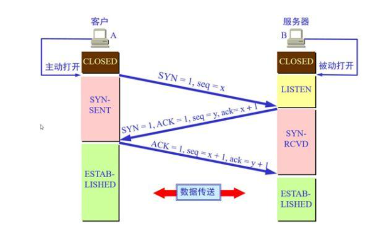
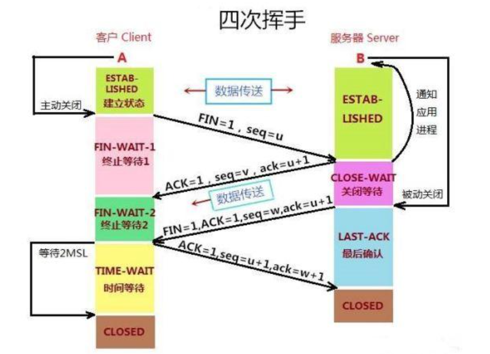

# 计算机网络知识总结

## TCP/UDP 
TCP  三次握手示意图

TCP 四次挥手示意图

为什么要有三次握手？
* 第一次握手是请求，第二次握手是回应。如果没有第三次握手，服务器端并不知道客户端是否收到了它的回应，此时它不能直接开启数据传送阶段，因为并不知道客户端是否是否收到。
* 另一种情况是，为了防止已失效的连接请求报文段突然又传送到了服务端，因而产生错误。谢希仁版《计算机网络》中的例子是这样的，“已失效的连接请求报文段”的产生在这样一种情况下：client发出的第一个连接请求报文段并没有丢失，而是在某个网络结点长时间的滞留了，以致延误到连接释放以后的某个时间才到达server。本来这是一个早已失效的报文段。但server收到此失效的连接请求报文段后，就误认为是client再次发出的一个新的连接请求。于是就向client发出确认报文段，同意建立连接。假设不采用“三次握手”，那么只要server发出确认，新的连接就建立了。由于现在client并没有发出建立连接的请求，因此不会理睬server的确认，也不会向server发送数据。但server却以为新的运输连接已经建立，并一直等待client发来数据。这样，server的很多资源就白白浪费掉了。采用“三次握手”的办法可以防止上述现象发生。例如刚才那种情况，client不会向server的确认发出确认。server由于收不到确认，就知道client并没有要求建立连接。”
* 此外还有一个原因，三次握手是为了确定传输序号seq，第一次握手客户端发送了自己的传输序号，第二次握手服务端回应收到了客户端的序号并且附上了自己的序号，第三次握手时客户端需要对服务端的序号进行确认。
为什么要有四次挥手？ 
* 首先一点，服务端的回应要分两次，第一次回应客户端的挥手请求，第二次进行关闭连接，在第一次和第二次回应之间进行遗留数据包的发送。
* 其次，客户端为什么要最后进行一次挥手呢，这是因为如果没有这一次回应，服务端直接关闭连接，而客户端恰好没有收到服务端发出的FIN包，客户端会持续等待服务端进行遗留数据的传输而保持连接不关闭。
  
TCP如何具有可靠性？
* 依靠请求重传、超时重发的机制。客户端和服务端在数据传输的过程中，双方各持有一个序号字段seq，每次收到对方的数据包并且进行回应时，会返回相应的ack = seq + 1.

为什么TIME_WAIT状态还需要等2MSL后才能返回到CLOSED状态？
(MSL指的是Maximum Segment Lifetime：一段TCP报文在传输过程中的最大生命周期。)
* 这是因为：虽然双方都同意关闭连接了，而且握手的4个报文也都协调和发送完毕，按理可以直接回到CLOSED状态（就好比从SYN_SEND状态到ESTABLISH状态那样）；但是因为我们必须要假想网络是不可靠的，你无法保证你最后发送的ACK报文会一定被对方收到，因此对方处于LAST_ACK状态下的SOCKET可能会因为超时未收到ACK报文，而重发FIN报文，所以这个TIME_WAIT状态的作用就是用来重发可能丢失的ACK报文。 

为什么需要传输层？
* 网络层提提供的是主机到主机的通信服务。而我们的主机上却运行这大量的应用（进程）。如何把进程和主机关联起来便是传输层的核心功能。

## HTTP

## SSH、 SSL 和 HTTPS（学名TLS）

### SSH

SSH登录远程主机的整个过程是这样的：

    （1）远程主机收到用户的登录请求，把自己的公钥发给用户。
    （2）用户使用这个公钥，将登录密码加密后，发送回来。
    （3）远程主机用自己的私钥，解密登录密码，如果密码正确，就同意用户登录。

但是实施的时候存在一个风险：如果攻击者截获了登录请求，然后冒充远程主机，将伪造的公钥发给用户，那么用户很难辨别真伪，如果用户将加密后的密码发回，攻击者将使用伪造的公钥相应的私钥进行解密，然后得到密码，这是著名的“中间人攻击”。

### SSH是如何解决中间人攻击的？
1、口令登录  
依旧使用上述的方法，但ssh服务会返回此时该host的指纹，需要用户进行自己比对和判定，决定是否接受该主机的公钥以用来加密密码。

2、公钥登录
用户生成公私钥，将公钥置于服务器上。登录时，服务器发来一段字符串，用户使用私钥加密发回服务器，服务器使用对应公钥进行解密，与原字符串对应即可登录。

### SSL
上述的SSH协议只在SSH客户端和SSH服务器之间进行。为了扩大其使用范围，设计了SSL协议。SSL是为了整个互联网上的所有客户端与服务器之间通信而设计的。

### HTTPS

SSL/TLS协议的基本过程是这样的：

    （1） 客户端向服务器端索要并验证公钥。

    （2） 双方协商生成"对话密钥"。

    （3） 双方采用"对话密钥"进行加密通信。

使用证书CA来保证公钥的真实性，证书由相关机构颁发，具有有效期。使用对话密钥（对称加密）来提高加密速度。

### 耗时分析
比较http和https 通信过程：

    HTTP耗时 = TCP握手

    HTTPs耗时 = TCP握手 + SSL握手

## GET 和 POST 方法比较
大致来说，GET用于请求信息，POST用于更新信息。

区别1：具体的使用方面，GET请求的数据会附在URL之后，就是把数据放置在HTTP协议头中；POST把提交的数据则放置在是HTTP包的主体中。  

区别2：首先浏览器通常都会限制url长度在2K个字节，而大多数服务器最多处理64K大小的url。所以受限于浏览器和服务器，GET传送的数据量较小，不能大于2KB。post传送的数据量较大，一般被默认为不受限制。但理论上，IIS4中最大量为80KB，IIS5中为100KB。

区别3：GET安全性低？？？因为能在浏览框里看到？其实本质差不多。

区别4：GET 用于获取信息，是无副作用的，是幂等的，且可缓存， 而POST 用于修改服务器上的数据，有副作用，非幂等，不可缓存。

